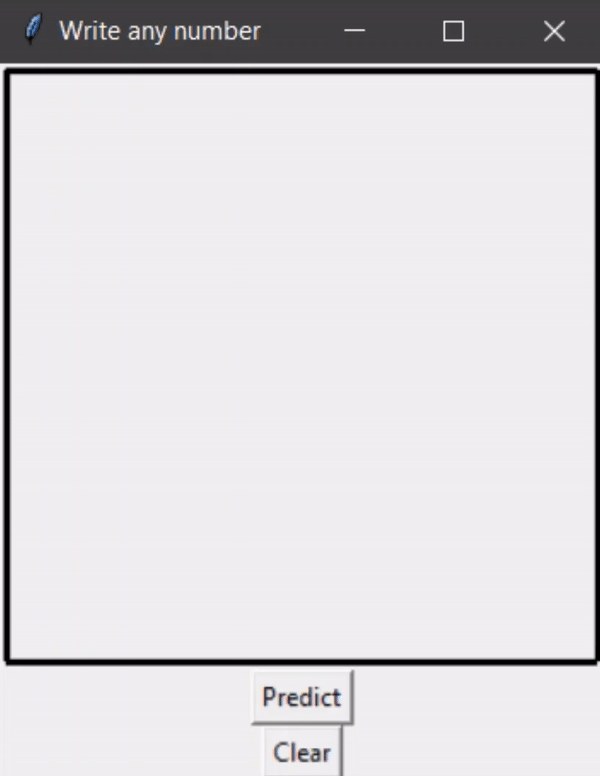

Handwritten Digit Prediction 
============================

This project uses the MNIST dataset to train a model using an ANN from first principles. 
The neural net has 784 inputs (corresponding to 28x28 pixel images), 1 hidden layer with 
25 units, and 10 output units, one per digit (0-9).

Due to the first principles implementation, training the neural net is much slower as 
compared to implementations using widely popular libraries. As a result, only 60% of the 
available data is used to train the network. Nonetheless, it achieves ~90% accuracy in 
predicting the training set.

A simple GUI is also included, allowing the user to write numbers using the mouse. A prediction 
is made using the optimized weights and bias values.
 

